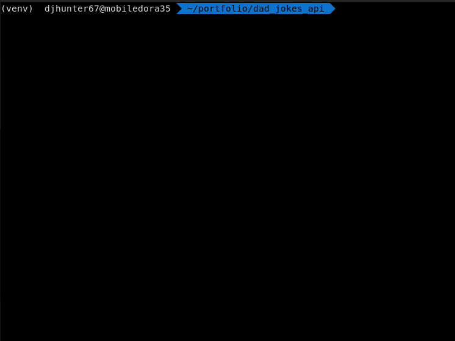

# Django REST framework

This is the first project in my professional portfolio. <br>
Author: ```Christerpher V. Hunter```<br>
 - Specialty: 
    - ```Python```
    - ```Django```
    - ```Dev Ops```
    
Python: ```Python 3.10.3``` <br>
Pip: ```pip 22.0.4``` <br>
Django: ```Django 4.0```<br>

## Synopsys

This project will feature a Django REST Framework (DRF) application programming interface (API).  
- Functional RESTful API
- Basic ```WebPack5``` frontend
- Basic test integration for endpoints


## Dad Joke API


- initial directory structure


